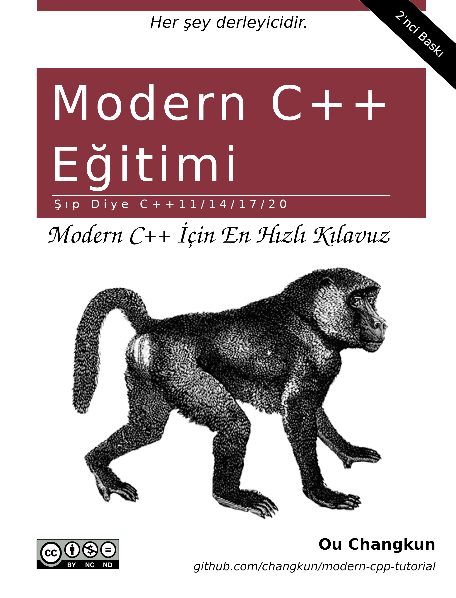

# Modern C++ Eğitimi: Şıp Diye C++11/14/17/20

 [](./README.md) [](./README-zh-cn.md) [](./README-tr-tr.md) [](./assets/donate.md)
## Amaç

Bu kitap C++'ı "Şıp Diye" öğreteceğini iddia ediyor. Amacı, modern C++ ile ilgili (2020'ler öncesi) özelliklere kapsamlı bir giriş sağlamaktır.
Okuyucular, aşağıdaki içindekiler tablosundan öğrenmek veya hızlıca aşinalık kazanmak istedikleri yeni özellikler hakkında ilginç içerikler seçebilirler.
Okuyucular, bu özelliklerin hepsinin birden gerekli olmadığını bilmelidir. Bunun yerine, bunlar gerçekten ihtiyaç duyulduğu zaman öğrenilmelidir.

Aynı zamanda, kitap sadece kodlama öğretmek yerine, teknik gereksinimlerinin tarihsel arka planını da (mümkün olabildiğince basit bir şekilde) tanıtıyor, bu da bu özelliklerin neden ortaya çıktığını anlamada büyük yardım sağlıyor.

Ayrıca yazar, okuyucuları yeni projelerinde doğrudan modern C++ kullanmaya ve kitabı okuduktan sonra eski projelerini kademeli olarak modern C++'a geçirmeye teşvik etmek istiyor.

## Hedefler

- Bu kitap, okuyucuların halihazırda geleneksel C++'a (yani C++98 ve öncesine) aşina olduklarını veya en azından geleneksel C++ kodunu okumakta zorluk çekmediklerini varsayar. Başka bir deyişle, geleneksel C++'ta uzun deneyime sahip olanlar ve modern C++'ın özelliklerini kısa sürede hızlı bir şekilde anlamak isteyenler kitabı okumak için çok uygundur.

- Bu kitap, bir dereceye kadar modern C++'ın kara büyüsünü tanıtıyor. Ancak bu sihir numaraları çok sınırlıdır, ileri düzey C++ öğrenmek isteyen okuyucular için uygun değildir. Bu kitabın amacı, modern C++ için hızlı bir başlangıç sunmaktır. Elbette, ileri düzey okuyucular da bu kitabı modern C++'ı incelemek ve kendilerini C++ konusunda test etmek için kullanabilirler.

## Başlangıç

Aşağıdaki okuma yöntemlerinden birini seçebilirsiniz:

- [GitHub Çevrimiçi](./book/tr-tr/toc.md)
- [PDF Belgesi](https://changkun.de/modern-cpp/pdf/modern-cpp-tutorial-tr-tr.pdf)
- [EPUB Belgesi](https://changkun.de/modern-cpp/epub/modern-cpp-tutorial-tr-tr.epub)
- [İnternet Sitesi](https://changkun.de/modern-cpp)

## Kod

Bu kitabın her bölümü çok sayıda kod içeriyor. Kitapta tanıtılan özelliklerle ilgili kendi kodunuzu yazarken sorun yaşıyorsanız kitabın ekindeki kaynak kodları okumanız işinize yarayabilir. Kitaptaki kodları [burada](./code) bulabilirsiniz. Tüm kodlar bölümlere göre düzenlenmiştir, klasör adı bölüm numarasıdır.

## Alıştırmalar

Kitabın her bölümünün sonunda birkaç alıştırma var. Bunlar, mevcut bölümdeki bilgiye hakim olup olmadığınızı test etmek içindir. Soruların olası yanıtlarını [burada](./exercises) bulabilirsiniz. Yine, klasör adı bölüm numarasıdır.

## İnternet Sitesi

Bu kitabın [hexo](https://hexo.io) ve [vuejs](https://vuejs.org) ile inşa edilen [web sitesinin](https://changkun.de/modern-cpp) kaynak kodu [burada](./website) yer almaktadır. İnternet sitesi size kitabı okumanın başka bir yolunu sunar, ayrıca mobil tarayıcılarla da uyumludur.

## İnşa

Her şeyi yerelde kendiniz inşa etmekle ilgileniyorsanız [Docker](https://docs.docker.com/install/) kullanmanız önerilir. İnşa etmek için aşağıdaki komutu çalıştırmanız yeterlidir:

```bash
$ make build
```

## Teşekkür

Bu kitap aslen [Changkun Ou](https://changkun.de) tarafından Çince yazılmıştır.

Yazarın zamanı ve dil becerileri sınırlıdır. Okuyucu olarak kitapta herhangi bir hata veya yazım iyileştirmesi bulursanız bir [kayıt](https://github.com/changkun/modern-cpp-tutorial/issues) açmaktan veya bir [değişiklik isteği](https://github.com/changkun/modern-cpp-tutorial/pulls) başlatmaktan çekinmeyin. Ayrıntılı yönergeler ve kontrol listesi için lütfen [Nasıl katkıda bulunulur](CONTRIBUTING.md) bölümüne bakın.

Yazar, [Katkıda Bulunanlar](https://github.com/changkun/modern-cpp-tutorial/graphs/contributors) dahil ancak bunlarla sınırlı olmamak üzere tüm katkıcılara minnettardır.

<p>Bu proje aynı zamanda aşağıdaki kurumdan/kurumlardan destek almaktadır:</p>
<p>
  <a href="https://www.digitalocean.com/?refcode=834a3bbc951b&utm_campaign=Referral_Invite&utm_medium=Referral_Program&utm_source=CopyPaste">
    
  </a>
</p>

## Lisanslar

<a rel="license" href="http://creativecommons.org/licenses/by-nc-nd/4.0/"></a><br />Bu çalışma [Ou Changkun](https://changkun.de) tarafından yazılmıştır ve <a rel="license" href="https://creativecommons.org/licenses/by-nc-nd/4.0/deed.tr">Creative Commons Attribution-NonCommercial-NoDerivatives 4.0 International License</a> ile lisanslanmıştır. Bu depodaki kaynak kodlar, [MIT lisansı](./LICENSE) altında açık kaynaklıdır.
